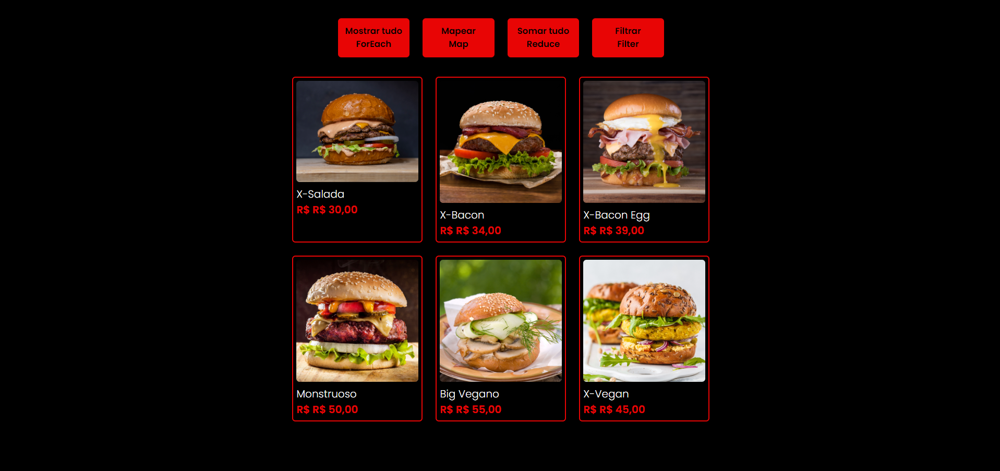

<h1 align="center">BUGUER SHOP</h1>

 Um projeto de uma landpage de uma hambugueria, mostrando seu cardapio de opçoões de lanches usando
 
<ul>
  <li>ForEach</li>
  <li>Map</li>
  <li>Reduce</li>
  <li>Filter</li>
</ul>

<h3>PROJETO REALIZADO COM AS FERRAMENTAS:</h3>

 
  
  
 
 

 

<h3>Link do projeto</h3>
<a href="https://buguershop-kaiokaled.netlify.app/">buguershhop.com</a>
